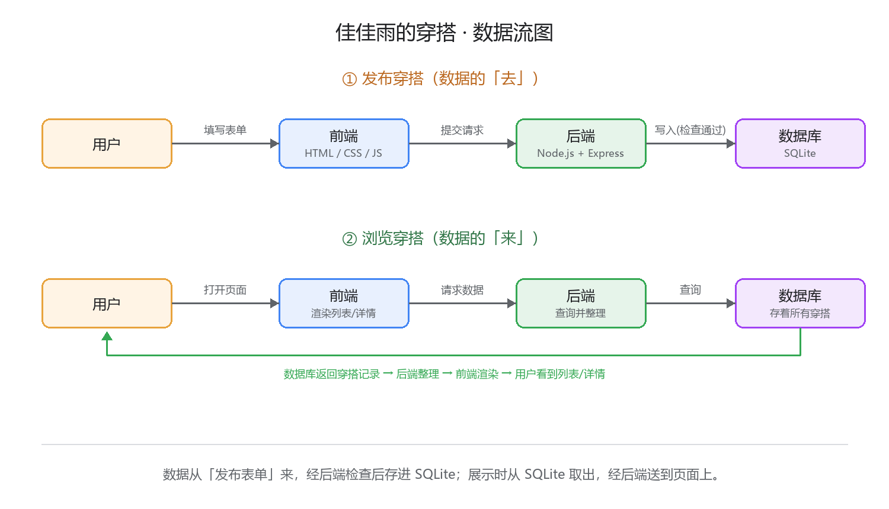

# TECH_DESIGN.md —— 佳佳雨的穿搭 · 技术设计

- 日期：2026-09-20（Day 5）
- 作者：FLORA88-cmd（佳佳雨）
- 版本：v1
- 上游文档：PRD.md（Day 4）

## 1. 技术路线（一句话）

原生 HTML/CSS/JS 做前端，Node.js + Express 做后端，SQLite 做数据库——三件各司其职，零额外安装，Day 7 能跑通。

## 2. 角色分工：谁用什么技术

| 角色 | 技术 | 在本项目里干什么 |
|---|---|---|
| 前端 | 原生 HTML / CSS / JavaScript | 穿搭列表页、详情页、发布表单的样子和交互 |
| 后端 | Node.js + Express | 接收发布/查看请求、检查必填项、读写数据库 |
| 数据库 | SQLite（单文件，随项目走） | 存一条条穿搭记录：昵称、上衣、裤子、心得、发布时间 |

## 3. 为什么这么选（每条都有理由）

| 选择 | 理由 |
|---|---|
| Node.js 做后端 | Day 1 环境验收时 Node.js v22 已经装好（现成工具不新装）；它用 JavaScript 写后端，和前端同一种语言，零基础只需要认一种语言 |
| Express 做后端框架 | 它是 Node 世界最常见、最简单的后端框架，教程和 AI 熟悉度都最高，出错好查；不额外引入更复杂的框架 |
| SQLite 做数据库 | 整个数据库就是项目里的一个文件，不用安装数据库软件、不用配账号密码；满足 PRD「数据由网站自己保存」，且和「本期不做登录」的轻量定位匹配 |
| 原生 HTML/CSS/JS 做前端 | 不引入打包工具（构建配置对零基础是纯坑）；PRD 只有 3 个功能、页面结构简单，原生完全够用 |

## 4. 为什么放弃另外两条路线

| 放弃的路线 | 放弃理由 |
|---|---|
| 纯前端 + 浏览器 localStorage | 数据只存在自己电脑的浏览器里，清缓存就没、别人看不到——PRD 的核心方向「社区分享」名存实亡，且今天学的前后端分工只用到前端 |
| 云服务代后端（BaaS） | 要注册第三方服务、联网配置，不可控因素多；对「学 vibe coding 写东西」的目标不对口 |

## 5. 这条路线怎么支撑 PRD 的验收标准

- **AC1/AC4（看列表、看详情）**：Express 提供页面路由，SQLite 提供数据
- **AC2（发布）**：表单 → Express 接收 → 写入 SQLite → 回列表页置顶
- **AC3（必填校验）**：Express 在后端检查必填项，不合格直接退提示

## 6. 数据流图

### 一句话版

数据从「发布表单」来，经后端检查后存进 SQLite；展示时从 SQLite 取出，经后端送到页面上。

### 文字版

**发布穿搭（数据的「去」）**

```
用户 --填写表单(昵称/上衣/裤子/心得)--> 前端发布页
前端发布页 --提交请求--> Express 后端
Express 后端 --必填项检查,不合格退回提示--> 前端显示错误
Express 后端 --检查通过,写入--> SQLite 数据库
```

**浏览穿搭（数据的「来」）**

```
用户 --打开首页/点开详情--> 前端页面
前端页面 --请求数据--> Express 后端
Express 后端 --查询--> SQLite 数据库
SQLite 数据库 --返回穿搭记录--> Express 后端
Express 后端 --整理成页面数据--> 前端渲染 --> 用户看到列表/详情
```

### 图片版

见同目录 `data-flow.png`（与上图内容一致）。


